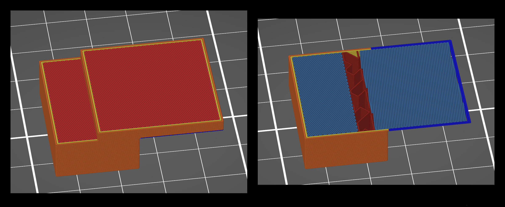
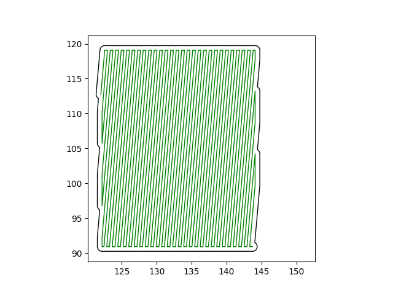
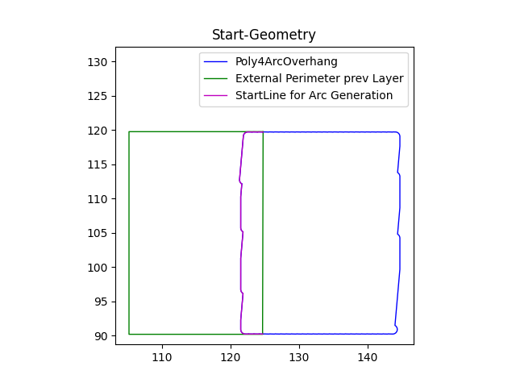
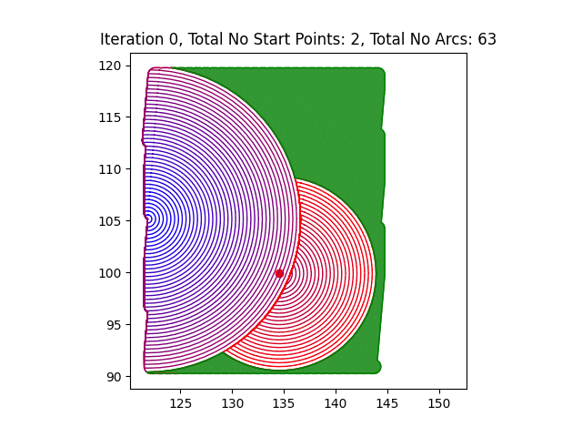
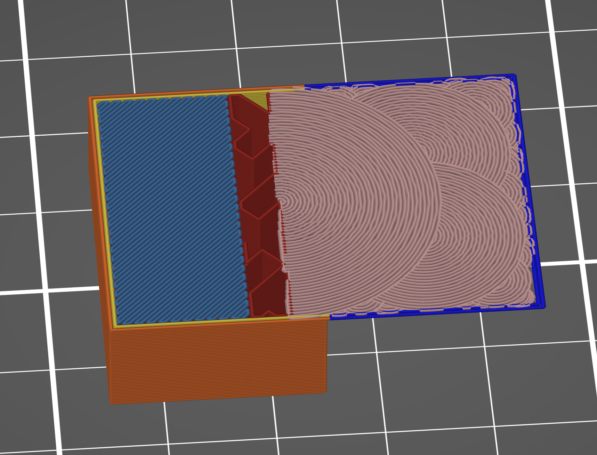

# Arc Overhang

  

A 3D printer toolpath generation algorithm that lets you print up to 90° overhangs without support material, original Idea by Steven McCulloch: https://github.com/stmcculloch/arc-overhang
Original fork by Nicolai Wachenschwan: https://github.com/nicolai-wachenschwan/arc-overhang-prusaslicer-integration

I am standing on the shoulders of giants and trying to bring this functionality to more people. All I have done is make it work with OrcaSlicer (formerly Soft Fever)

**Now it is easy and convinient to use by integrating the functionality into OrcaSlicer as a post-processing script.**

Steven and I hope that some day this feature gets integrated into slicing software. But until then you can use this script to get the added functionalitiy today!

## 0. Videos

- Arc Overhang Initial Video: https://youtu.be/fjGeBYOPmHA
- CNC kitchen's video: https://youtu.be/B0yo-o47688
- Steven's Instagram: https://www.instagram.com/layershift3d/
- DalTron's video: COMING SOON! https://www.youtube.com/@DalTronPrinting

This is a basic visualisation how the algorithm works: 

(this visualisation uses depth first generation, the current version uses breadth first search algorithm to fill the remaining space in the overhang.
## 1. Brief Explanation (from Steven McCulloch):

1. You can print 90° overhangs by wrapping filament around itself in concentric **arcs**. You may have seen the [fullcontrol.xyz overhang challenge](https://fullcontrol.xyz/#/models/b70938). This uses the exact same principle.
Here's what this effect looks like while printing:  

2. You can start an **arc** on an **arc** to get ridiculously large overhangs.
To get perfect results you need to tune the process to fit your machine. Also it is painfully slow, but still faster than support + removal :P

For more details visit: https://github.com/stmcculloch/arc-overhang
## 3. Setup-Process
1. download and install Python 3, at least Version 3.5, check the "add to PATH" box during the installation.
2. install the librarys [shapely](https://shapely.readthedocs.io/en/stable/), [numpy](https://numpy.org/) and [matplotlib](https://matplotlib.org/) **and new [numpy-hilbert-curve](https://pypi.org/project/numpy-hilbert-curve/)** via "python -m pip install "+library-name in your console (type cmd in start-menu search).
3. Ready to go! Tested only with OrcaSlicer 1.4.5 & Python 3.10 :)

## 4. How to use it:
#### Option A) via Console
Simply open your system console and type 'python ' 
followed by the path to this script 
and the path of the gcode file. Will overwrite the file.
#### Option B) use it as a automatic post-processing script in OrcaSlicer
1. open Orca Slicer, go to Process-Others. Locate the post-processing-script text area.
2. In that window enter: `C:\full\path\to\your\python.exe C:\full\path\to\this\script\including\orca_slicer_slicer_post_processing_script.py`  (with blank space between the two paths!). For unix like systems (linux, macOS, ecc.) use the `/` instead of `\`, obtaining something like this: `full/path/to/your/python full/path/to/this/script/including/orca_slicer_post_processing_script.py`

3. Copy and paste this and modify (windows user only): "C:\Users\Your User Folder\AppData\Local\Programs\Python\***Python313***\python.exe" "C:\\Users\\Your User Folder\\**Your Post Processing Scripts Folder Location**\\orca_slicer_post_processing_script_wmac.py";
         Notes: ***Python313*** is my current version. Change this to whatever folder. It's the default location where python installs on windows.
         **Your Post Processing Scripts Folder Location**: Locate your post processing script location and replace all the '\'  with '\\'
         
   
5. OrcaSlicer will execute the script after the export of the Gcode, therefore the view in OrcaSlicer wont change. 
6. Open the finished gcode file to see the results.

Notes to nail it first try:
If the python path contains any empty spaces, mask them as described here (using "\ " on unix like sistems and "! " on windows): 
https://manual.slic3r.org/advanced/post-processing
https://help.prusa3d.com/article/post-processing-scripts_283913

If you want to change generation settings: Open the Script in an editor, scroll to 'Parameter' section. Settings from OrcaSlicer will be extracted automaticly from the gcode.

## 5. Current Limitations
1. Some settings need to be taylored to your specific geometry, just like you adapt the settings in your slicer. Details below.
2. Code is slow on more complicated models, but is not optimized for speed yet.
3. The Arcs are extruded very thick, so the layer will be 0.1-0.5mm thicker (dependend on nozzle dia) than expected
=>if precision needed make test prints to counter this effect.
4. Some warping, when printing the follow up layers. Balance the cooling of these layers with gravity/heat softening. There are parameters defined in the parameter section. Working on optimized settings. 
5. no wiping or z-hop during travel moves
6. remaining print time shown during printing is wrong. The real printtime can be seen when opening the finished file in GcodeViewer.
7. will take the first island of the prev. perimeter as a startpoint. If you dont like that point, turn the models along z-axis.
8. delets solid infill incl the last travel move if multiple islands present. Causes small defect. Fixing in progress.
9. Scaling of the hilbert-infill is non-linear. Fixing in progress, would appreciate if you submit a solution via pull request :)
10. settings testet for PLA only. You can of cause try other materials and share your knowlege here!
11. Physics: The arcs need to be able to support their own weight without much deformation. Therefore narrow and long bridges will be generated, but not print successfull. Use some supports to stabilize critical areas.

## 5.1 Updates:
Reduced warping significantly! The warping is caused by the follow-up layers that contract during the cooldown. This effect is most prominent along a long line.
We can break up the massive infill bottom layers in multiple small lines by changing direction as in a hilbert-curve. A hilbert curve pattern is associatet with the smallest residual thermal stresses [Reasearch on SLS-3d-printing](https://www.researchgate.net/publication/313685481_Fractal_Scan_Strategies_for_Selective_Laser_Melting_of_'Unweldable'_Nickel_Superalloys). This shows great success, but some more time is needed to find the limits (e.g printing speed) and effects of this printing strategy. 
The script has now the added functionality to convert solid infill layers close to the arcs into hilbert-curve infill. Also it splits up the curve to avoid heat accumulation and therefore softening of the material below.

Unfortunately we can't do so for the perimeters, so print them as slow as possible and with the least cooling possible. The script now has parameters defined to adress this automaticly.

On the other hand: printing without cooling causes the overhang to bend downwards. Possibly caused by the added weight + heat softening, so a balance of the thermal contraction forces and gravity might be a solution. For me cooling at 10% worked quite nice. Research is in Progress, Steven and I would be happy if you share your knowlege and experiences from you prints!

Example images of minimized warping, tested on extreme overhang with 100mm diameter:

  

The bulging downwards happens due to the geometry of the object: The long arcs contract when cooled down, causing some stress in the printed part. The next one adds more contraction stress, that release in the bulging. This happens due to physics and geometry. The bulging issue can be solved by a)set rMax to 40mm, b) change the geometry so the arclines are splited into multiple parts and extreme long arcs are avoided.

The warping of <2mm is in my opinion acceptable, as we talk about a very large surface and it is only occuring at the very edge.

## 6. Suggested Print Settings
Some OrcaSlicer PrintSettings will be checked and warned if "wrong".

### Important Settings in the Script are:

a) **"ArcCenterOffset":** The surfacequality is imporved by Offsetting the arc center, because the smallest r is larger->more time to cool. Set to 0 to get into delicate areas.

b) **"ExtendIntoPerimeter":** Enlargen the Area, where Arcs are Generated. Increase to thicken small/delicate passages. minValue for the algorithm to work is 0.5extrusionwidth! 

c) **"MaxDistanceFromPerimeter":** Controls how bumpy you tolerate your edge. big: less tiny arcs, better surface. small:follow the curvature more exact.

d) Thresholds for area and bridging length, adjust as needed, but Arc shine at large surfaces :)

e) **"UseLeastAmountOfCenterPoints":** experimental: use only one arc-center until rMax is reached (then iterate as usual), improves surface finish but can lead to failed prints on complex geometrys.

f) Adjust the cooling and print speed of the follow-up layers to reduce warping as needed.(More cooling->more warping)

### General Print Settings: 
The overhang print quality is greatly improved when the material solidifies as quickly as possible. Therefore:
  
1. **Print as cold as possible.** I used 190 degrees for PLA. You can probably go even lower. If you require higher temp for the rest of the print, you could insert could insert some temp-change gcode before and after the arcs are printed. Might waste a lot of time though.
   
2. **Maximize cooling.** Set your fans to full blast. I don't think this technique will work too well with ABS and materials that can't use cooling fans, but I haven't tested it.
3. **Print slowly.** I use around 2 mm/s. Even that is too fast sometimes for the really tiny arcs, since they have almost no time to cool before the next layer begins.

## 6.1 Examples:

  

## 7. Room for Improvement
We would be happy if you contribute!
The surface-finish seems to be better with using as little as possible start points for the arcs. but where are the Limits? Finding an algorithm deciding when to start a new arc, working reliable an a wide set of geometrys is the next ongoing developement. I you have any questions/ideas I would be happy if you share them!

Printing long overhangs is tricky due to gravity. a meet in the middle concept could help, but how do we teach that to the computer?
Feel free to encorporate any Ideas in the post-processing script and try them!

Further optimize the settings or add features like z-hop and quality of life features like correct displaying of remaining print time.

## 8. Printer Compatibility

By default, the output gcode should print fine on most standard desktop FDM printers you can use with OrcaSlicer. OrcaSlicer is mandatory as the script listens to sepcific keywords....

## 9. Easy Way to try Out

If you want to try the prints without installing, Steven and I added some test print gcode files in the root directory that you can directly download. They should print fine on most printers although you may need to manually adjust the gcode so that it works with your printer.

## 10. Print it! 
If you get a successful print using this algorithm, I'd (and I am sure Steven to) love to hear about it.

## 11. How the Post-Procssing-Script works
The script analyses the given gcode-file and splits it into layers. For every layer the informations are saved as an object (Class:Layer).
Than it searches for "Bridge Infill" tag in the gcode, kindly provided by OrcaSlicer.

The process will be shown with this simple example geometry(left). It has Bridge Infill at 2 areas in one layer, the right one is the overhang we want to replace.(right)

The real work is done by the shapely-Library. The Algorithm extracts the gcode and converts it into a shapely line (plot:green). By thickening the line we get one continous Polygon(plot black):

The Polygon is verified by several steps, including touching some overhang perimeter.
To find a start point the external perimeter of the previous layer is extracted and the intersection area with our Polygon calculated.
The commom boundary of the intersection area and the Polygon will be the startline (magenta) for the arc generation.

For each step concentric arcs are generated, until they hit a boundary or rMax. The Farthest Point on the pervious arc will be the next startpoint.

The process is repeated until all points on the arcs are close enough to the boundary or overprinted by other arcs.
Finally the gcode file will be rewritten. All infos are copied and the Arcs are injected at the beginning of the layer. the replaced bridge infill will be excluded:

